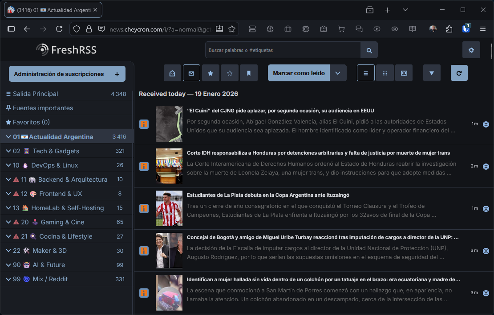

# [Flatcap](https://github.com/cheycron/flatcap-theme) for FreshRSS

 

**[Flatcap](https://github.com/cheycron/flatcap-theme)** is a dark, minimalist, and eye-friendly theme for the self-hosted RSS reader, **[FreshRSS](https://freshrss.org/)**. It's meticulously crafted to provide a comfortable and focused reading experience.

  

## 🚀 How to Install

To use this theme in FreshRSS, please follow these steps:

1.  **Set Base Theme**: In your FreshRSS settings, navigate to **Profile -> Theme** and select **'Nord'**. This theme builds upon the Nord structure, making this step essential.
2.  **Enable Custom CSS**: Go to **Extensions** and activate the **'CustomCSS'** extension.
3.  **Apply the Theme**:
    *   Open the `flatcap.css` file from this repository.
    *   Copy the entire content of the file.
    *   Paste it into the text area provided by the 'CustomCSS' extension and save.

---

## 🎨 Philosophy & Design

**[Flatcap](https://github.com/cheycron/flatcap-theme)** draws inspiration from the *Nord theme*, embracing principles of calm, clean aesthetics, and a dimmed pastel color approach.

### Color Palette

The system relies on **20 core colors** divided into four distinct families.

| Family | Description |
| :--- | :--- |
| **Deep Twilight** | Structural foundation. Deep backgrounds (`#121418`) and sidebars (`#191c22`). |
| **Dawnlight** | Typography hierarchy. From muted metadata (`#b2b6bf`) to crisp body text (`#cbced5`). |
| **Ocean Blues** | Primary interaction. Calming blues (`#81a1c1`) for actions and navigation. |
| **Vivid Accents** | Semantic feedback. Desaturated accents for errors (`#bf616a`) and success (`#a3be8c`). |

## ✒️ Typography & Fonts

For the best reading experience, we recommend having these fonts installed:

*   **[Inter](https://fonts.google.com/specimen/Inter)** (UI & Interface)
*   **[Merriweather](https://fonts.google.com/specimen/Merriweather)** (Article Content / Serif Mode)
*   **[Cascadia Code NF](https://github.com/microsoft/cascadia-code/releases)** (Code Blocks)

---

  Distributed under the MIT License.

  

